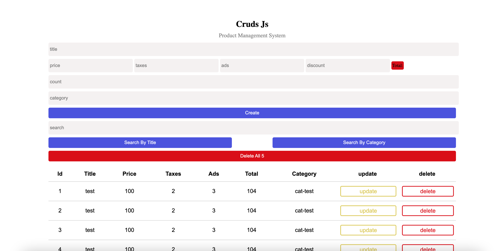

# 🛒 CRUDs JS - Product Management System

A simple and responsive Product Management System built using **HTML, CSS, and Vanilla JavaScript**.  
This project demonstrates full CRUD operations with localStorage support and dynamic calculations.

<p align="center">
<a href="https://crudjs-product-management-system.netlify.app/">View Demo</a>
</p>
---

## 🚀 Features

- ✅ Create new products
- 📖 Read and display products in a table
- ✏️ Update existing products
- ❌ Delete single product
- 🗑️ Delete all products
- 🔎 Search by title
- 🔎 Search by category
- 💰 Automatic total price calculation (Price + Taxes + Ads - Discount)
- 💾 Data saved in localStorage
- 📱 Responsive UI

---

## 🧮 Product Fields

Each product contains:

- Title
- Price
- Taxes
- Ads
- Discount
- Total (Auto Calculated)
- Count
- Category

---

## 🛠️ Technologies Used

- HTML5
- CSS3
- JavaScript (Vanilla JS)
- LocalStorage API

---

## 📸 Project Preview




---


## ⚙️ How It Works

1. Enter product details.
2. Total price is calculated automatically.
3. Click **Create** to add the product.
4. Products appear in the table.
5. The system will create multiple product entries
6. Use Update or Delete buttons to manage items.
7. Data is stored in browser localStorage.
8. You can search by Title Or Category

---

## 💡 Learning Purpose

This project is great for practicing:

- DOM manipulation
- JavaScript logic
- Arrays & Objects
- localStorage handling
- Dynamic rendering
- Event handling

---

## 🚀 Getting Started
1. Clone the repository:
   ```bash
   git clone https://github.com/yasmin-alharasis/Product-Management-System.git

2. Run index.html file 